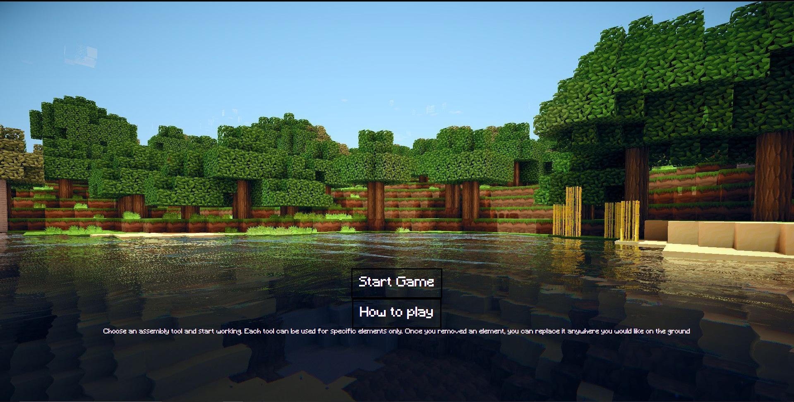
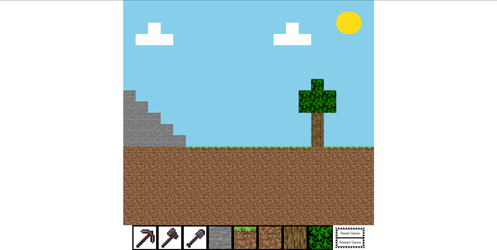
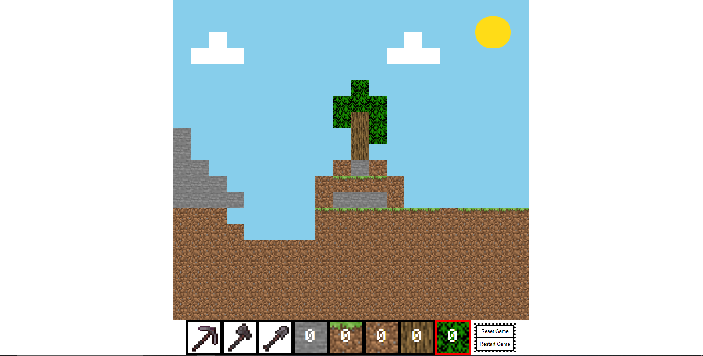

# Minecraft-Project

[Live Demo: Minecraft](https://rougenij-minecraft.netlify.app/)
------------------

### This Project was made by using:
1. HTML
2. CSS
3. Javascript

The idea behind this project was to re create a simple version of the game i grew up playing, and see what challenges i can face when i try new things.

# Features
- You can only mine blocks with the correct tool (Pickaxe for stone, Shovel for Dirt, Axe for Wood and leaves)
- You cant mine block that is being blocked by other blocks

# Current state of the Chatting App Project :
---------------------------------

-------------------------------------

------------------------------------

## Future Plans for this project:
1. Fix the "Place a block in the Air"
2. Pre generated world
3. Add night time
4. Add more blocks
5. Add more tools
6. Add more inventory space

### CopyRight Claim

[Minecraft](https://www.minecraft.net/en-us)

